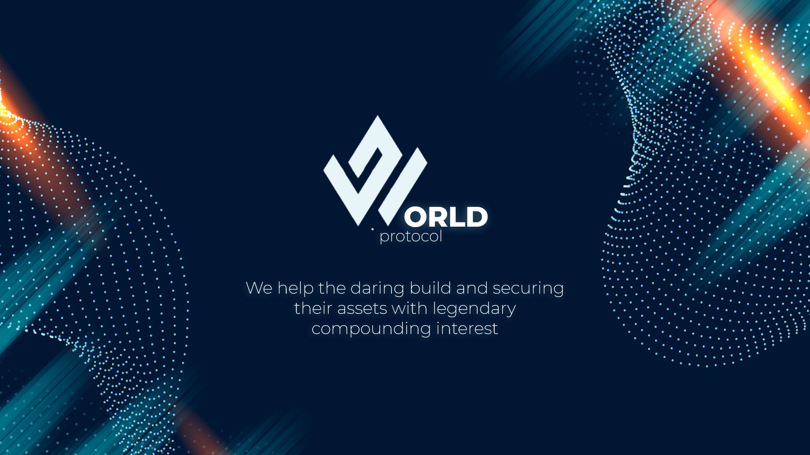

---

  
### Quick Links
  

  

  
  
 
  
 
  
  

---

### The World token availibity! 🥳 🚀

- iOS/macOS: Search for "well: reboot your mindset" on the [iOS app store](https://apps.apple.com/us/app/well-reboot-your-mindset/id1573357406).
- Web: Visit [https://well-app.netlify.app](https://well-app.netlify.app). Install as a PWA for native-like functionality!
- Android: coming soon 👀

---

 

# :man_with_gua_pi_mao:  :guardsman: :speech_balloon: :japanese_ogre: Our team 

- Joffrey Weertz 
  - Tag [@wrld_token](https://twitter.com/wrld_token) and/or `#WorldProtocol`

- Samuel Dhayeng
  - Tag [@wrld_token](https://twitter.com/wrld_token) and/or `#WorldProtocol`
  
- Malima Anthony
  - Tag [@wrld_token](https://twitter.com/wrld_token) and/or `#WorldProtocol`

- Hector Ruiz
  - Tag [@wrld_token](https://twitter.com/wrld_token) and/or `#WorldProtocol`

# 🧐 Project philosophy

> The World protocol aim to support the cash flow of a massive user cashout token
 in order to raise the capitalization of the token for new users
> 
> 
**Read more about the World Protocol on [the project homepage]().**

# 📒 Wiki

This project repository has [a great wiki](https://github.com/jSUNSH1NEw/MoralisAvalanchehackathon/wiki) that you should consider reading! It goes into detail about the project from a more technical aspect. If you are interested in learning more about the dAPP itself, go ahead and check it out!

# 👨‍💻 Tech stack

Here's a brief high-level overview of the tech stack the World protocol uses:

# ✍️ Contributing

Interested in contributing to the World Protocol ? Thanks so much for your interest! We are always looking for improvements to the project and contributions from open-source developers are greatly appreciated.

If you have a contribution in mind, please check out our [Contribution Guide]()

# 🌟 Spread the word!

If you want to say thank you and/or support active development of the Well app:

- Add a GitHub Star to the project!
- Tweet about the project on your Twitter!
  - Tag [@wrld_token](https://twitter.com/wrld_token) and/or `#WorldProtocol`

# ⚠️ License

The WRLD decentralise application is free and open-source software licensed under the GNU General Public License v3.0. All designs were created by [Joffrey Weertz](https://github.com/chroline).

 

---

 

# 💛

Reminder that *you are great, you are enough, and your presence is valued.* 
